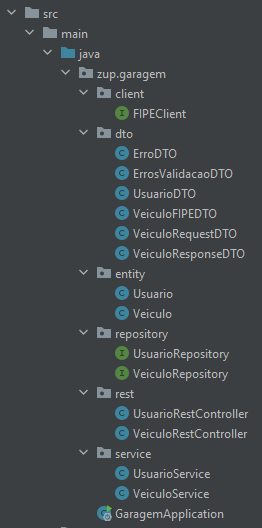

# Gerenciando o rodízio de vagas para veículos utilizando Java e Spring

Introdução e explicação do que foi pedido

## Tecnologias

### Spring e Java

Explique qual linguagem e quais as tecnologias do mundo Spring você usaria.

Conte qual o papel das tecnologias escolhidas e quais benefícios elas trazem para a implementação do código. 

### Hibernate e H2 Database

Usarei o Hibernate em conjunto com banco de dados H2, duas tecnologias amplamente usada em projetos Springs. O Hibernate será importante para tornar a manipulação com o banco menos trabalhosa e mais amigável ao público iniciante. Isso por que ele fornece várias das funções mais comuns já implementadas e também nos poupar de escrever comandos SQL para tarefas simples. Porém, sua maior vantagem está no fato de ser uma camada que abstrai o acesso aos dados, podendo trabalhar em conjunto com vários SGBDs e permitindo a eventual migração de um para outro.

O H2 foi escolhido por ser um dos banco de dados mais simples de ser utilizado no Spring Boot. Como consequência da simplicidade, é um boa escolha quando estamos começando com Spring ou só estamos criando o protótipo de uma ideia. Ele não exige configuração alguma, basta apenas adicioná-lo às dependências do projeto, e é o mais leve das opções disponíveis. Mas calma, o H2 guarda seus dados na memória RAM, ou seja, eles não serão persistidos entre execuções do programa, tudo é apagado ao desligar o backend. Mesmo assim esrve para construir es

### Spring-Cloud-Feign


### Por que não usar Lombok

Optei por **não** usar Lombok neste projeto por um único motivo. Ele é uma ferramenta muito útil para esconder o código boiler plate dos Getters, Setters e construtores, mas esta vantagem na redução do código visível pode se tornar um problema para quem está iniciando sua carreira. 

Ao ler códigos de minha autoria e de terceiros, vi que em alguns casos as anotações eram usadas indevidamente. Notei que sempre tive preferência por usar o `@Data` por resolver na maioria dos casos, mas sem perceber que, às vezes, estava gerando construtores e outras funções que nunca eram usadas, além de métodos acessores em variáveis que não precisavam (ou sequer deviam) ser acessadas.

Usar o Lombok *corretamente* exige assumir a responsabilidade de usar anotações que gerem exatamente o código necessário, o que requer um conhecimento aprofundado na sintaxe da ferramenta. Infelizmente, alguns programadores inadvertidamente usam-o sem saber exatamente o que está adicionando ao código. Resolvi assumir essa responsabilidade apenas futuramente, talvez quando tiver mais seguro na linguagem.

## Implementação

### Modelo de desenvolvimento

Modelo Iterativo.

Cada incremento vai adicionando ao sistema novas capacidades funcionais, até a obtenção do sistema final. Busca contornar
algumas das limitações existentes no modelo Queda d’Água e também e combinar as vantagens do modelo Prototipação. É como
executar vários  “miniprojetos” onde cada um adiciona novas funcionalidades no software final até que o mesmo esteja 
completo. A metodologia mais conhecida no momento que segue deste modelo é a SCRUM.

### Estrutura de pastas

Os arquivos foram separados nas seguintes pastas:
 - **entity**: definições das tabelas do banco de dados;
 - **repository**: classes responsáveis por recuperar dados no banco;
 - **service**: classes responsáveis por utilizar os repositories e tratar os dados que estes enviam e recebem;
 - **rest**: controladores REST. São responsáveis por receber as requisições HTTP, decidir o que fazer com os dados recebidos e o que mandar como resposta. Quando um dado precisam ser salvos ou recuperado do banco, eles usam o service adequado para tal;
 - **client**: clientes REST de API externas. Neste projeto, é usado apenas um para consultar o preço de determinados veículos;
 - **dto**: objetos de transferência de dados. É onde estão definidos o conteúdo dos objetos recebidos e enviados pela nossa API.




### Entidades

Diga quais classes seriam criadas nesse processo e traga trechos autorais explicando a construção de cada classe do código.

As duas entidades (ou tabelas) criadas foram `Usuario` e `Veiculo`, cujas classes de ambos constam somente: definição das colunas, construtor com todas variáveis, construtor vazio e métodos getters. 

No Usuário, temos além do ID os campos:
- `String` nome: não nulo;
- `String` email: não nulo e único;
- `String` cpf: não nulo e único;
- `Date` dataNascimento: pode ser nulo.

```Java
package zup.garagem.entity;

// Imports

@Entity
public class Usuario {
    @Id
    @GeneratedValue(strategy = GenerationType.IDENTITY)
    private Long id;

    @NotNull
    private String nome;

    @Column(nullable = false, unique = true)
    private String email;

    @Column(nullable = false, unique = true)
    private String cpf;

    @JsonFormat(shape = JsonFormat.Shape.STRING, pattern = "dd-MM-yyyy")
    private Date dataNascimento;

    public Usuario(String nome, String email, String cpf, Date dataNascimento) {
        this.nome = nome;
        this.email = email;
        this.cpf = cpf;
        this.dataNascimento = dataNascimento;
    }

    public Usuario() {
    }

    public Long getId() {
        return id;
    }

    public String getNome() {
        return nome;
    }

    public String getEmail() {
        return email;
    }

    public String getCpf() {
        return cpf;
    }

    public Date getDataNascimento() {
        return dataNascimento;
    }
}
```

Já no veículo, temos além do ID:
- `String` marca: não nulo;
- `String` modelo: não nulo;
- `String` anoModelo: código do ano que deve ser enviado para API da FIPE, por exemplo, "2020-1". Não nulo;
- `String` valor: preço do veículo com o 'R$' na frente. Pode ser nulo.
- `DayOfWeek` diaRodizio: dia da semana no qual o carro pode ocupar a vaga. Não nulo.
- `Usuario` usuarioDono: o dono do veículo. Essa coluna na verdade guarda apenas o ID de um usuário existente na tabela correspondente.


```Java
package zup.garagem.entity;

// Imports

@Entity
public class Veiculo {
    @Id
    @GeneratedValue(strategy = GenerationType.IDENTITY)
    private Long id;

    @NotNull
    private String marca;

    @NotNull
    private String modelo;

    @NotNull
    private String anoModelo;

    private String valor;

    @ManyToOne
    @JoinColumn(name = "usuario_id", nullable = false)
    private Usuario usuarioDono;

    private DayOfWeek diaRodizio;

    public Veiculo() {
    }

    public Veiculo(Long id,
                   String marca,
                   String modelo,
                   String anoModelo,
                   String valor,
                   Usuario usuarioDono,
                   DayOfWeek diaRodizio) {
        this.id = id;
        this.marca = marca;
        this.modelo = modelo;
        this.anoModelo = anoModelo;
        this.valor = valor;
        this.usuarioDono = usuarioDono;
        this.diaRodizio = diaRodizio;
    }

    public Long getId() {
        return id;
    }

    public String getMarca() {
        return marca;
    }

    public String getModelo() {
        return modelo;
    }

    public String getAnoModelo() {
        return anoModelo;
    }

    public String getValor() {
        return valor;
    }

    public Usuario getUsuarioDono() {
        return usuarioDono;
    }

    public DayOfWeek getDiaRodizio() {
        return diaRodizio;
    }
}
```

Aqui, o emprego do `@ManyToOne` serve para mapear vários veículos à um usuário. Tanto essa anotação quanto a `@OneToMany` podem 

Note que não tem sentido em persistir no banco o booleano indicando se o carro pode ocupar a vaga no dia de hoje, pois este valor varia todo dia. Decidi por fazer seu cálculo somente se um usuário da API requisitá-lo.

### Client REST

### DTOs

### REST controller


## Funcionamento

### Cadastro de usuário

### Cadastro de veículo

### Listagem de veículos do usuário