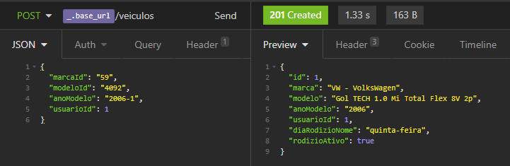
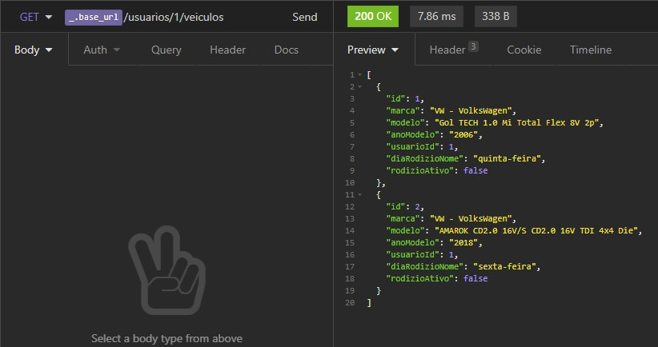

# Gerenciando o rodízio de vagas para veículos utilizando Java e Spring

TODO: Introdução e explicação do que foi pedido

## Tecnologias

### Spring e Java

Explique qual linguagem e quais as tecnologias do mundo Spring você usaria.

Conte qual o papel das tecnologias escolhidas e quais benefícios elas trazem para a implementação do código.

### Hibernate e H2 Database

Usarei o Hibernate em conjunto com banco de dados H2, duas tecnologias amplamente usada em projetos Springs. O Hibernate será importante para tornar a manipulação com o banco menos trabalhosa e mais amigável ao público iniciante. Isso por que ele fornece várias das funções mais comuns já implementadas e também nos poupar de escrever comandos SQL para tarefas simples. Porém, sua maior vantagem está no fato de ser uma camada que abstrai o acesso aos dados, podendo trabalhar em conjunto com vários SGBDs e permitindo a eventual migração de um para outro.

O H2 foi escolhido por ser um dos banco de dados mais simples de ser utilizado no Spring Boot. Como consequência da simplicidade, é um boa escolha quando estamos começando com Spring ou só estamos criando o protótipo de uma ideia. Ele não exige configuração alguma, basta apenas adicioná-lo às dependências do projeto, e é o mais leve das opções disponíveis. Mas calma, o H2 guarda seus dados na memória RAM, ou seja, eles não serão persistidos entre execuções do programa, tudo é apagado ao desligar o backend. Mesmo assim, serve para prototipar nossa aplicação, afinal, podemos migrar para outro banco posteriormente.

### Spring Cloud Feign

Nosso backend precisa comunicar-se com uma API REST. Uma forma bem prática de se fazer isso é usando o projeto Spring Cloud Feign. Ele nos permite criar as requisições por meio da definição de funções numa interface, mais ou menos como fazemos com os `@Repository`. A diferencça é que o dados vêm de outra aplicação web ao invés do banco de dados local. Outra funcionalidade do Feign é que ele pode construir objetos de classes locais a partir dos JSONs recebidos, desde que tenham os mesmos campos.

### Por que não usar Lombok

Optei por **não** usar Lombok neste projeto por um único motivo. Ele é uma ferramenta muito útil para esconder o código boiler plate dos Getters, Setters e construtores, mas esta vantagem na redução do código visível pode se tornar um problema para quem está iniciando sua carreira.

Ao ler códigos de minha autoria e de terceiros, vi que em alguns casos as anotações eram usadas indevidamente. Notei que sempre tive preferência por usar o `@Data` por resolver na maioria dos casos, mas sem perceber que, às vezes, estava gerando construtores e outras funções que nunca eram usadas, além de métodos acessores em variáveis que não precisavam (ou sequer deviam) ser acessadas.

Usar o Lombok *corretamente* exige assumir a responsabilidade de usar anotações que gerem exatamente o código necessário, o que requer um conhecimento aprofundado na sintaxe da ferramenta. Infelizmente, alguns programadores inadvertidamente usam-o sem saber exatamente o que está adicionando ao código. Resolvi assumir essa responsabilidade apenas futuramente, talvez quando tiver mais seguro na linguagem.

## Implementação

### Modelo de desenvolvimento

A aplicação foi desenvolvida seguindo o modelo *iterativo e incremental*.


"Cada incremento vai adicionando ao sistema novas capacidades funcionais, até a obtenção do sistema final. Busca contornar algumas das limitações existentes no modelo Queda d’Água e também e combinar as vantagens do modelo Prototipação. É como executar vários  “miniprojetos” onde cada um adiciona novas funcionalidades no software final até que o mesmo esteja completo. A metodologia mais conhecida no momento que segue deste modelo é a SCRUM."

### Estrutura de pastas

Os arquivos foram separados nas seguintes pastas:

- **entity**: definições das tabelas do banco de dados;
- **repository**: classes responsáveis por recuperar dados no banco;
- **service**: classes responsáveis por utilizar os repositories e tratar os dados queestes enviam e recebem;
- **rest**: controladores REST. São responsáveis por receber as requisições HTTP, decidiro que fazer com os dados recebidos e o que mandar como resposta. Quando um dado precisamser salvos ou recuperado do banco, eles usam o service adequado para tal;
- **client**: clientes REST de API externas. Neste projeto, é usado apenas um paraconsultar o preço de determinados veículos;
- **dto**: objetos de transferência de dados. É onde estão definidos o conteúdo dosobjetos recebidos e enviados pela nossa API.


### Entidades

"Diga quais classes seriam criadas nesse processo e traga trechos autorais explicando a construção de cada classe do código."

As duas entidades (ou tabelas) criadas foram `Usuario` e `Veiculo`, cujas classes de ambos constam somente: definição das colunas, construtor com todas variáveis, construtor vazio e métodos getters.

No Usuário, temos além do ID os campos:

- `String nome`: não nulo;
- `String email`: não nulo e único;
- `String cpf`: não nulo e único;
- `Date dataNascimento`: pode ser nulo.

```Java
package zup.garagem.entity;

// Imports

@Entity
public class Usuario {
    @Id
    @GeneratedValue(strategy = GenerationType.IDENTITY)
    private Long id;

    @NotNull
    private String nome;

    @Column(nullable = false, unique = true)
    private String email;

    @Column(nullable = false, unique = true)
    private String cpf;

    @JsonFormat(shape = JsonFormat.Shape.STRING, pattern = "dd-MM-yyyy")
    private Date dataNascimento;

    public Usuario(String nome, String email, String cpf, Date dataNascimento) {
        this.nome = nome;
        this.email = email;
        this.cpf = cpf;
        this.dataNascimento = dataNascimento;
    }

    public Usuario() {
    }

    public Long getId() {
        return id;
    }

    public String getNome() {
        return nome;
    }

    public String getEmail() {
        return email;
    }

    public String getCpf() {
        return cpf;
    }

    public Date getDataNascimento() {
        return dataNascimento;
    }
}
```

Já no veículo, temos além do ID:

- `String marca`: não nulo;
- `String modelo`: não nulo;
- `String anoModelo`: código do ano que deve ser enviado para API da FIPE. Por exemplo, "2020-1". Não nulo;
- `String valor`: preço do veículo com o 'R$' na frente. Pode ser nulo.
- `DayOfWeek diaRodizio`: dia da semana no qual o carro pode ocupar a vaga. Não nulo.
- `Usuario usuarioDono`: o dono do veículo. Essa coluna na verdade guarda apenas o ID de um usuário existente na tabela correspondente.

```Java
package zup.garagem.entity;

// Imports

@Entity
public class Veiculo {
    @Id
    @GeneratedValue(strategy = GenerationType.IDENTITY)
    private Long id;

    @NotNull
    private String marca;

    @NotNull
    private String modelo;

    @NotNull
    private String anoModelo;

    private String valor;

    @ManyToOne
    @JoinColumn(name = "usuario_id", nullable = false)
    private Usuario usuarioDono;

    private DayOfWeek diaRodizio;

    public Veiculo() {
    }

    public Veiculo(Long id,
                   String marca,
                   String modelo,
                   String anoModelo,
                   String valor,
                   Usuario usuarioDono,
                   DayOfWeek diaRodizio) {
        this.id = id;
        this.marca = marca;
        this.modelo = modelo;
        this.anoModelo = anoModelo;
        this.valor = valor;
        this.usuarioDono = usuarioDono;
        this.diaRodizio = diaRodizio;
    }

    public Long getId() {
        return id;
    }

    public String getMarca() {
        return marca;
    }

    public String getModelo() {
        return modelo;
    }

    public String getAnoModelo() {
        return anoModelo;
    }

    public String getValor() {
        return valor;
    }

    public Usuario getUsuarioDono() {
        return usuarioDono;
    }

    public DayOfWeek getDiaRodizio() {
        return diaRodizio;
    }
}
```

Aqui, o emprego do `@ManyToOne` serve para mapear vários veículos à um usuário. Para identificar qual anotação usar, eu uso o macete a seguir. Tanto aquela anotação quanto a `@OneToMany` podem podem ser interpretadas de forma similar: a primeira palavra se refere à classe a qual pertence e a última à variável que está logo abaixo a variável usuarioDono, estou fazendo com que haja "Many Veiculo para One usuarioDono".

Note que não há sentido em persistir no banco o booleano indicando se o carro pode ocupar a vaga no dia de hoje, pois este valor varia todo dia. Decidi por fazer seu cálculo somente se um usuário da API requisitá-lo.

### DTOs

Mostrarei exemplos dos DTOs mais interessantes do projeto. A ideia por trás deles é definir quais dados devem ser recebidos na requisição e quais devem ser enviados nas respostas. Eles servem como uma interface de dados para os utilizadores de nossa API, pois nem sempre queremos mandar todos os campos das tabelas em nosso banco.

É uma boa prática dividir o DTO em duas versões, uma com os campos que devemos receber e outra com os campos que queremos enviar, mas nem sempre isso é necessário. Na nossa API, somente a entidade Veiculo precisou ter um `VeiculoRequestDTO` e um `VeiculoResponseDTO`. O primeiro é usado para realziar o cadastro de um novo veículo no banco e conta apenas com os campos de ID, tais como: `marcaId`, `modeloId`, `anoModelo`, `usuarioId`; O segundo é o objeto retornado na listagem de veículos de um usuário, logo, contém o devido nome da marca, modelo, ano e o valor.

Em geral, os DTOs são classes com o objetivo principal de guardar valores e não devem conter funções significativas, muito menos regras de negócios. Neste projeto, fiz com que eles tivessem apenas dois construtores e os métodos getters. A ausência de setters obriga com que eles sejam imutáveis.

```Java
package zup.garagem.dto;

import com.fasterxml.jackson.annotation.JsonFormat;
import org.hibernate.validator.constraints.Length;

import javax.validation.constraints.Email;
import javax.validation.constraints.NotNull;
import java.util.Date;

public class UsuarioDTO {
    private Long id;

    @NotNull(message = "Nome é obrigatório")
    @Length(min = 3, max = 100, message = "Nome deve ter de 3 a 100 caracteres")
    private String nome;

    @NotNull(message = "Email é obrigatório")
    @Email(message = "Email inválido")
    private String email;

    @NotNull(message = "CPF é obrigatório")
    @Length(min = 11, max = 11, message = "CPF deve ter exatamente 11 dígitos")
    private String cpf;

    @JsonFormat(shape = JsonFormat.Shape.STRING, pattern = "dd-MM-yyyy")
    private Date dataNascimento;

    public UsuarioDTO(Long id, String nome, String email, String cpf, Date dataNascimento) {
        this.id = id;
        this.nome = nome;
        this.email = email;
        this.cpf = cpf;
        this.dataNascimento = dataNascimento;
    }

    public UsuarioDTO() {
    }

    public Long getId() {
        return id;
    }

    public String getNome() {
        return nome;
    }

    public String getEmail() {
        return email;
    }

    public String getCpf() {
        return cpf;
    }

    public Date getDataNascimento() {
        return dataNascimento;
    }
}
```

Notar que é nele que declaramos os critérios usados para fazer a validação dos valores e definimos as mensagens que serão retornadas em caso de inadequação. Para citar exemplos, definimos que o nome do usuário cadastrado deve conter de 3 a 100 caracteres e é obrigatório. Também obrigamos que haja um CPF e que seja fornecido apenas seus 11 dígitos.

Foi criado inclusive um DTO para as mensagens de erros de validação. Alguns dos campos contidos nele, como `timestamp`, `status` e `path`, foram incluídos para imitar a resposta padrão do Spring quando ocorre erro 500.

```Java
package zup.garagem.dto;

import org.springframework.http.HttpStatus;
import org.springframework.validation.BindingResult;

import java.util.ArrayList;
import java.util.Date;
import java.util.List;

public class ErrosValidacaoDTO {
    private final String timestamp;
    private final Integer status;
    private final List<ErroDTO> errors = new ArrayList<>();
    private final String message;
    private final String path;

    public ErrosValidacaoDTO(BindingResult resultadoValidacao, HttpStatus status, String message, String path) {
        this.message = message;
        this.path = path;
        this.status = status.value();
        this.timestamp = new Date().toString();

        for (var e : resultadoValidacao.getFieldErrors()) {
            errors.add(new ErroDTO(e.getField(), e.getDefaultMessage()));
        }
    }

    // Getters
}
```

Vemos que o construtor recebe o resultado da validação contendo os erros e estes são  adicionados em `List<ErroDTO> errors`. `ErroDTO`, por sua vez, serve para fazer um objeto com o título do erro e uma mensagem associada, como vemos a seguir.

```Java
package zup.garagem.dto;

public class ErroDTO {
    private final String titulo;
    private final String mensagem;

    public ErroDTO(String titulo, String mensagem) {
        this.titulo = titulo;
        this.mensagem = mensagem;
    }

    public String getTitulo() {
        return titulo;
    }

    public String getMensagem() {
        return mensagem;
    }
}
```

O objeto JSON gerado pelo `ErrosValidacaoDTO` tem esse formato:

```JSON
{
  "timestamp": "2021-05-22T19:01:26.349468800-03:00[America/Sao_Paulo]",
  "status": 400,
  "errors": [
    {
      "titulo": "email",
      "mensagem": "Email inválido"
    },
    {
      "titulo": "cpf",
      "mensagem": "CPF deve ter exatamente 11 dígitos"
    }
  ],
  "message": "Erro ao validar usuário",
  "path": "/usuarios"
}
```

E a resposta padrão do Spring é:

```JSON
{
  "timestamp": "2021-05-23T00:13:28.531+00:00",
  "status": 500,
  "error": "Internal Server Error",
  "message": "[...]",
  "path": "/veiculos"
}
```

### REST controller

### Cliente REST

Como dito anteriormente, o uso do `FeignClient` facilitou bastante a aquisição das informações sobre o veículo cadastrado. Abaixo, estão todas a linhas de código escritas para relizar a comunicação com a API da FIPE.

```Java
package zup.garagem.client;

import org.springframework.cloud.openfeign.FeignClient;
import org.springframework.web.bind.annotation.GetMapping;
import org.springframework.web.bind.annotation.PathVariable;
import zup.garagem.dto.VeiculoFIPEDTO;

@FeignClient(name = "fipeClient", url = "https://parallelum.com.br/fipe/api/v1/carros/")
public interface FIPEClient {
    @GetMapping("marcas/{marcaId}/modelos/{modeloId}/anos/{anoCodigo}")
    VeiculoFIPEDTO getVeiculo(@PathVariable String marcaId,
                              @PathVariable String modeloId,
                              @PathVariable String anoCodigo);
}
```

## Funcionamento

Os testes foram realizar usnado o programa Insomnia

### Cadastro de usuário

Exemplo de usuário com campos corretos:


Exemplo de usuário com campos corretos, mas já existente:


Abaixo, exemplo de usuário com e-mail e CPF inválidos. Vale lembrar que aqui a única validação aplicada ao CPF é o tamanho da String, porém, existem bilbiotecas Java que conseguem fazer este tratamento para nós.


### Cadastro de veículo

Exemplo de veículo e usuário válido:



Exemplo de veículo inválido, passando IDs nulos:


Exemplo de veículo válido, mas usuário inexistente. Requisição realizada antes de cadastrar o primeiro usuário com ID = 1:


Abaixo, exemplo de veículo e usuário válidos, mas veículo não existe na Tabela FIPE. Notar que todas informações estão corretas com exceção do "2006", que deveria ser "2006-1":


### Listagem de veículos do usuário

Listagem dos veículos do usuário por meio do end-point `{base_url}/usuario/{id}/veiculos`:



Como o ID já é enviado como `@PathVariable`, nada vai dentro do body.

## Conclusão
